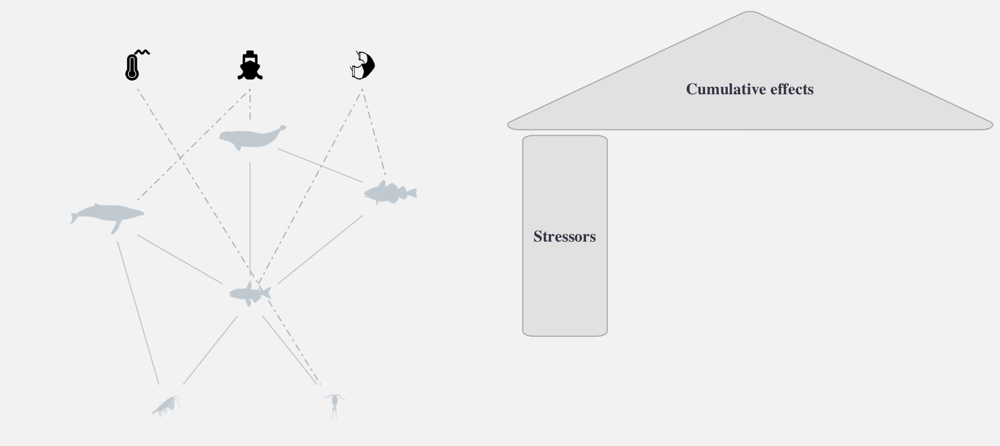
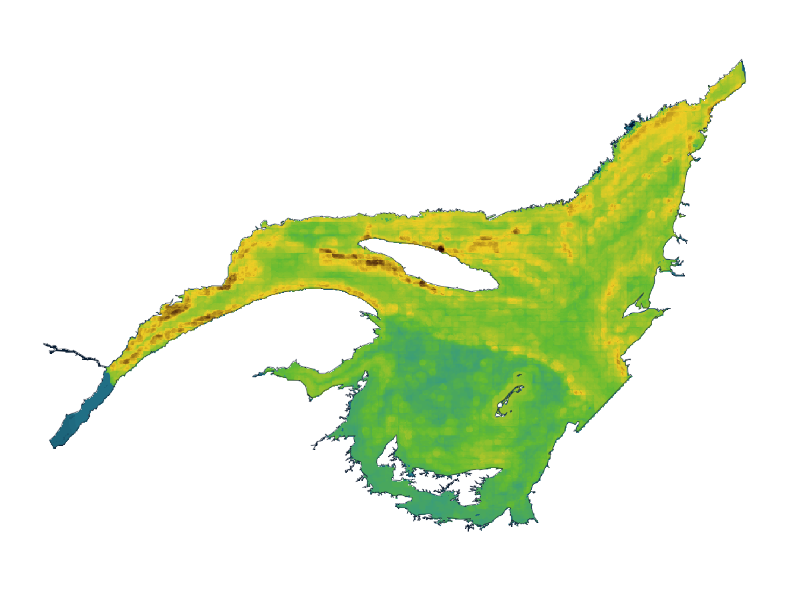
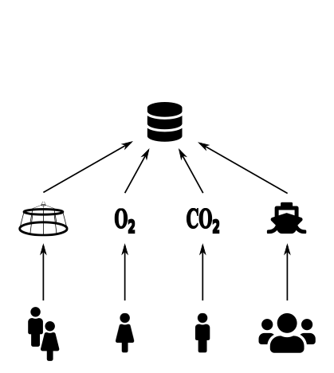
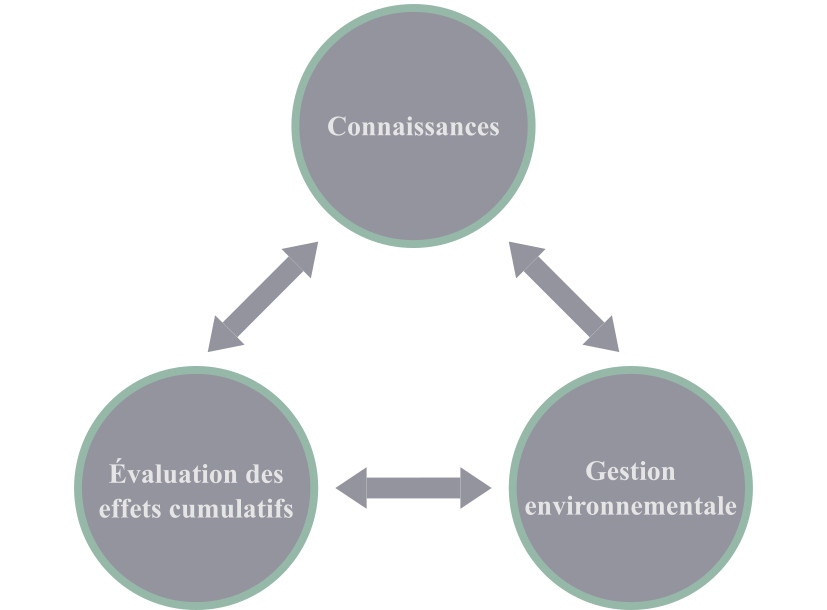

```{r setup, include=FALSE}
htmltools::tagList(rmarkdown::html_dependency_font_awesome())
```

class: title-slide, middle


# Évaluation des effets cumulatifs des changements globaux sur les communautés écologiques


.pull-left[
<center></img></center>
]

.pull-right[
<center></img></center>
]


### David Beauchesne et Philippe Archambault

<span class="br2"></span>

<center></img></center>

#### 2021-02-12


<!-- =~-~=~-~=~-~=~-~=~-~=~-~=~-~=~-~=~-~=~-~=~-~=~-~=~-~=~-~=~-~=~-~=~-~= -->
<!-- =~-~=~-~=~-~=~-~=~-~=~-~=~-~=~-~=~-~=~-~=~-~=~-~=~-~=~-~=~-~=~-~=~-~= -->
<!-- =~-~=~-~=~-~=~-~=~-~=~-~=~-~=~-~=~-~=~-~=~-~=~-~=~-~=~-~=~-~=~-~=~-~= -->
<!-- Évaluation des effets cumulatifs -->
<!-- =~-~=~-~=~-~=~-~=~-~=~-~=~-~=~-~=~-~=~-~=~-~=~-~=~-~=~-~=~-~=~-~=~-~= -->
<!-- =~-~=~-~=~-~=~-~=~-~=~-~=~-~=~-~=~-~=~-~=~-~=~-~=~-~=~-~=~-~=~-~=~-~= -->
<!-- =~-~=~-~=~-~=~-~=~-~=~-~=~-~=~-~=~-~=~-~=~-~=~-~=~-~=~-~=~-~=~-~=~-~= -->

---

class: inverse, center, middle

# Évaluation des effets cumulatifs

<html><div style='float:left'></div><hr color='#ffdd55' style="margin-top:-30px" size=1px width=720px></html>

<h2 style="color:#ffdd55;"><b>Approche générale</b></h2>
<h2>Système du Saint-Laurent</h2>
<h2>Gestion des connaissances</h2>

---

# Approche générale

## Une perspective écosystémique

**Gestion écosystémique** : *gestion guidée par des objectifs explicites, exécutée par des politiques, des protocoles et des procédures, et rendu adaptable par des suivis et de la recherche basée sur notre meilleure compréhension des interactions et processus écologiques nécessaires pour maintenant la composition, la structure et la fonction des écosystèmes.*


.references[
Christensen et al. (1996); Sinclair et al. (2017)
]


---


# Approche générale

## Évaluation des effets cumulatifs <!--Cumulative effects assessment-->

<span class="br2"></span>

<center></img></center>

.references[
Halpern et al. 2008; Halpern et al. 2015
]

---

# Approche générale

## Évaluation des effets cumulatifs <!--Cumulative effects assessment-->

<span class="br2"></span>

<center></img></center>

.references[
Halpern et al. 2008; Halpern et al. 2015
]

---

# Approche générale

## Évaluation des effets cumulatifs <!--Cumulative effects assessment-->

<span class="br2"></span>

<center></img></center>

.references[
Halpern et al. 2008; Halpern et al. 2015
]

---

# Approche générale

## Évaluation des effets cumulatifs <!--Cumulative effects assessment-->

<span class="br2"></span>

<center></img></center>

.references[
Halpern et al. 2008; Halpern et al. 2015
]

---

# Approche générale

## Évaluation des effets cumulatifs <!--Cumulative effects assessment-->

<span class="br2"></span>

<center></img></center>

.references[
Halpern et al. 2008; Halpern et al. 2015
]

---

# Approche générale

## Évaluation des effets cumulatifs <!--Cumulative effects assessment-->

<span class="br2"></span>

<center></img></center>

.references[
Halpern et al. 2008; Halpern et al. 2015
]

---

# Approche générale

## Évaluation des effets cumulatifs <!--Cumulative effects assessment-->

<span class="br2"></span>

<center></img></center>

.references[
Halpern et al. 2008; Halpern et al. 2015
]

---


# Approche générale

## Évaluation des effets cumulatifs <!--Cumulative effects assessment-->

<span class="br2"></span>

<center></img></center>

.references[
Halpern et al. 2008; Halpern et al. 2015
]


---

# Approche générale

## Évaluation des effets cumulatifs <!--Cumulative effects assessment-->

<span class="br2"></span>

<center></img></center>

.references[
Halpern et al. 2008; Halpern et al. 2015
]

???

Fournit une approche intégrative et prédictive pour l'évaluation des effets cumulatifs des stresseurs environnementaux sur les écosystèmes


---

# Approche générale

## Évaluation des effets cumulatifs <!--Cumulative effects assessment-->

<span class="br2"></span>

<center></img></center>

???

- Considère toutefois que les stresseurs et les espèces sont indépendantes
- Plusieurs auteurs considèrent qu'il est irréaliste de considérer intégrer les interactions écologiques au sein d'évaluations environnementales dû à leur complexité
- Dans le cadre de ma thèse, je me suis efforcé à démontrer l'inverse en explorant l'importance de considérer les interactions et en développant une approche pour considérer explicitement les interactions et ainsi faire une évaluation des effets cumulatifs qui prend en considération les effets directs et indirects des stresseurs environnementaux.

---

# Approche générale

.pull-left2[
## Interactions écologiques

**Indirect effects**

- Loutre
- Oursins
- Laminaires
]

.pull-right2[
<center></img></center>
]

.references[
Estes et Palmisano 1974; Paine 1980; Abrams 1992;  Estes et al. 2011
]

---

# Approche générale

.pull-left2[
## Interactions écologiques

**Indirect effects**

- Loutre
- Oursins
- Laminaires

## Importance

- Peuvent être aussi importants que les effets directs
]

.pull-right2[
<center></img></center>
]

.references[
Wootton 1993, 2002; Menge 1995; Yodzis 2000
]

---

# Approche générale

.pull-left2[
## Interactions écologiques

**Indirect effects**

- Loutre
- Oursins
- Laminaires

## Importance

- Peuvent être aussi importants que les effets directs

## Propagation des effets

- Structure des réseaux
  - Nombre d’interactions
  - Configuration
  - Intensité
]

.pull-right2[
<center></img></center>
]

.references[
Wootton 2002; Bascompte 2009; Montoya et al. 2009; O’Gorman et Emmerson 2009; O’Gorman et al. 2012
]

---

# Approche générale

.pull-left2[
## Interactions écologiques

**Indirect effects**

- Loutre
- Oursins
- Laminaires

## Importance

- Peuvent être aussi importants que les effets directs

## Propagation des effets

- Structure des réseaux
  - Nombre d’interactions
  - Configuration
  - Intensité
]

.pull-right2[
<center></img></center>
]

.references[
Wootton 2002; Bascompte 2009; Montoya et al. 2009; O’Gorman et Emmerson 2009; O’Gorman et al. 2012
]

---

# Approche générale

<center></img></center>


---

# Approche générale

<center></img></center>

---

# Approche générale

<center></img></center>

---

# Approche générale

<center></img></center>

---

# Approche générale

<center></img></center>

***Modèle conceptuel:*** incorporer les interactions écologiques

---


# Approche générale

<center></img></center>


***Modèle conceptuel:*** incorporer les interactions écologiques

***Pilliers supplémentaires:*** métaréseau et sensibilité trophique

---

# Approche générale

<center></img></center>


***Modèle conceptuel:*** incorporer les interactions écologiques

***Pilliers supplémentaires:*** métaréseau et sensibilité trophique


---

# Approche générale

<center></img></center>


***Modèle conceptuel:*** incorporer les interactions écologiques

***Pilliers supplémentaires:*** métaréseau et sensibilité trophique

***Évaluation:*** évaluation des effets cumulatifs communauté-centrées


<!-- =~-~=~-~=~-~=~-~=~-~=~-~=~-~=~-~=~-~=~-~=~-~=~-~=~-~=~-~=~-~=~-~=~-~= -->
<!-- =~-~=~-~=~-~=~-~=~-~=~-~=~-~=~-~=~-~=~-~=~-~=~-~=~-~=~-~=~-~=~-~=~-~= -->
<!-- =~-~=~-~=~-~=~-~=~-~=~-~=~-~=~-~=~-~=~-~=~-~=~-~=~-~=~-~=~-~=~-~=~-~= -->
<!-- Case study: EGSL -->
<!-- =~-~=~-~=~-~=~-~=~-~=~-~=~-~=~-~=~-~=~-~=~-~=~-~=~-~=~-~=~-~=~-~=~-~= -->
<!-- =~-~=~-~=~-~=~-~=~-~=~-~=~-~=~-~=~-~=~-~=~-~=~-~=~-~=~-~=~-~=~-~=~-~= -->
<!-- =~-~=~-~=~-~=~-~=~-~=~-~=~-~=~-~=~-~=~-~=~-~=~-~=~-~=~-~=~-~=~-~=~-~= -->
---

class: inverse, center, middle

# Effets cumulatifs <!-- Cumulative effects -->

<html><div style='float:left'></div><hr color='#ffdd55' style="margin-top:-30px" size=1px width=720px></html>

<h2>Approche générale</h2>
<h2 style="color:#ffdd55;"><b>Système du Saint-Laurent</b></h2>
<h2>Gestion des connaissances</h2>


---

# Système du Saint-Laurent <!--St. Lawrence System-->

.pull-left2[
- Estuaire du Saint-Laurent

- Golfe du Saint-Laurent
]

.pull-right2[
<center></img></center>
]


---


# Système du Saint-Laurent <!--St. Lawrence System-->

## Stresseurs


.pull-left[
- Climat (6)
- Terrestre (5)
- Pêcheries (5)
- Navigation (2)
]

.pull-right[
<center></img></center>
]

.references[
.font90[Halpern et al. 2015; DFO 2016; Statistics Canada 2017; Galbraith et al. 2018; Blais et al. 2019; Earth observation group 2019; Starr et Chassé 2019]
]

---

# Système du Saint-Laurent <!--St. Lawrence System-->

## Composantes valorisées

.pull-left2[
- Poissons et invertébrés (169)
- Mammifères marins (24)
- Interactions
]

.pull-right2[
<center></img></center>
]

.references[
.font90[Dutil et al. 2011, 2012; DFO 2016; Assis et al. 2018; Bourdages et al. 2018; Galbraith et al. 2018; Blais et al. 2019; Starr et Chassé 2019]
]

---

# Évaluation des effets cumulatifs

## Distribution spatiale

<span class="br2"></span>

<center></img></center>


---

# Évaluation des effets cumulatifs

## Séquences d'effets

.pull-left2[
- Liens entre stresseurs et espèces

- Caractérisation du risque associé à chaque stresseur et pour chaque espèce
]

.pull-right2[
<center></img></center>
]

---

# Évaluation des effets cumulatifs

## Évaluations individuelles

<span class="br2"></span>

<center></img></center>


---

# Évaluation des effets cumulatifs

## Effets directs et indirects

.pull-left2[

]

.pull-right2[
<center></img></center>
]

---

# Évaluation des effets cumulatifs

## Effets directs et indirects

.pull-left2[
*Effets directs :*

Invertébrés : Tous les stresseurs

- Espèces sessiles
- Alimentation
- Composition corporelle
- Plus sensibles à leur environnement physico-chimique

Vertébrés : Navigation et Pêche

- Espèces mobiles
- Minimiser exposition aux stresseurs

]

.pull-right2[
<center></img></center>
]

.references[
Kroeker et al. 2010, 2013; Sydeman et al. 2015; Stier et al. 2016
]

---

# Évaluation des effets cumulatifs

## Effets directs et indirects

.pull-left2[
*Effets indirects :*

Invertébrés : Tous les stresseurs

- Moindre intensité relative
- Ressource / méso-prédateurs

Vertébrés : Tous les stresseurs

- Intensité des effets indirects supérieure
- Espèces de plus haut niveau trophique
- Plus sensibles aux effets indirects

]

.pull-right2[
<center></img></center>
]

.references[
Kroeker et al. 2010, 2013; Sydeman et al. 2015; Stier et al. 2016
]


---

# Évaluation des effets cumulatifs

## Nouveau projet

- Application de l'approche sur le plateau néo-écossais
- Contribution Agreement: MSP Halifax


<!-- =~-~=~-~=~-~=~-~=~-~=~-~=~-~=~-~=~-~=~-~=~-~=~-~=~-~=~-~=~-~=~-~=~-~= -->
<!-- =~-~=~-~=~-~=~-~=~-~=~-~=~-~=~-~=~-~=~-~=~-~=~-~=~-~=~-~=~-~=~-~=~-~= -->
<!-- =~-~=~-~=~-~=~-~=~-~=~-~=~-~=~-~=~-~=~-~=~-~=~-~=~-~=~-~=~-~=~-~=~-~= -->
<!-- Gestion des connaissances -->
<!-- =~-~=~-~=~-~=~-~=~-~=~-~=~-~=~-~=~-~=~-~=~-~=~-~=~-~=~-~=~-~=~-~=~-~= -->
<!-- =~-~=~-~=~-~=~-~=~-~=~-~=~-~=~-~=~-~=~-~=~-~=~-~=~-~=~-~=~-~=~-~=~-~= -->
<!-- =~-~=~-~=~-~=~-~=~-~=~-~=~-~=~-~=~-~=~-~=~-~=~-~=~-~=~-~=~-~=~-~=~-~= -->
---

class: inverse, center, middle

# Effets cumulatifs

<html><div style='float:left'></div><hr color='#ffdd55' style="margin-top:-30px" size=1px width=720px></html>

<h2>Approche générale</h2>
<h2>Système du Saint-Laurent</h2>
<h2 style="color:#ffdd55;"><b>Gestion des connaissances</b></h2>

---

# Gestion des connaissances

## Défi de taille

<span class="br2"></span>

.pull-left[
- Quantité considérable de connaissances requises

- Typiquement détenues par une diversité d'experts

- Temps dédié à :
  - Recherche d'informations
  - Développement de collaborations
  - Mise en forme des connaissances

- **Chercher à faciliter la réutilisation et les utilisations secondaires**
]

.pull-right[
<center></img></center>
]


???

Le point à faire:

- L'évaluation des effets cumulatifs, que ce soit avec une perspective écosystémique ou non, requiert une quantité considérable de connaissance.

- Ces connaissances sont typiquement détenus par une diversité importance d'experts, que ce soit des chercheurs, des institutions, des citoyens ou des Premières Nations, etc.

- Travail important à faire pour rassembler les connaissances pour être en mesure d'évaluer les effets cumulatifs.

- Ça implique donc un temps considérable dédié à la recherche d'informations, au développement de collaborations et au formattage des connaissances récoltées

- Le problème avec une approche comme celle-là, c'est le temps requis pour être capable de rassembler l'information, et le temps requis pour refaire le travail de façon récurrente, p.ex. pour refaire une évaluation avec des données nouvelles, mises à jour ou améliorées.

- Faciliter l'utilisation secondaire des connaissances acquises

- Open data

---

# Gestion des connaissances

## Connaissances ouvertes

<span class="br2"></span>

.pull-left[
- Mouvement important vers le partage ouvert des connaissances

- Archivage et accès en ligne (p.ex. [OGSL](https://www.ogsl.ca))

- Avantages :
  - Reproductibilité
  - Transparence
  - Efficacité
  - Optimiser investissements
  - Valoriser connaissances
  - Collaboration
]

.pull-right[
<center></img></center>
]

---

# Gestion des connaissances

## Connaissances ouvertes

### Exemple: [*eDrivers*](https://david-beauchesne.shinyapps.io/edriversapp/)

<span class="br2"></span>

.pull-left2[

- Initiative de partage de connaissances sur les stresseurs

- Objectif:

> Créer une communauté d'experts commis à structurer, partager et standardiser les connaissances sur les stresseurs


]

.pull-right2[
<br/>
<center></img></center>

]


---

# Gestion des connaissances

## Gestion - Évaluation - Connaissances

<span class="br2"></span>

.pull-right2[
<center></img></center>
]


---

# Gestion des connaissances

## Gestion - Évaluation - Connaissances

<span class="br2"></span>

.pull-left2[
- Dissocier acquisition des connaissances
  - Efficacité
  - Structure commune
  - Accessibilité

- Collaboration, mobilisation et consultation demeurent primordiaux

- Discuter de gestion plutôt que d'acquisition de connaissances
]

.pull-right2[
<br/>
<center></img></center>
]

---

# Gestion des connaissances

## Gestion - Évaluation - Connaissances

<span class="br2"></span>

.pull-left2[
- Structurer les connaissances disponibles

- Identifier des lacunes en connaissances

- Dimensions humaines particulièrement lacunaires pour l'évaluation des effets cumulatifs
]

.pull-right2[
<br/>
<center></img></center>
]


---

# Gestion des connaissances

## Gestion - Évaluation - Connaissances

<span class="br2"></span>

.pull-left2[
- Évaluations strictement environnementales vers ...
]

.pull-right2[
<center></img></center>
]


---

# Gestion des connaissances

## Gestion - Évaluation - Connaissances

<span class="br2"></span>

.pull-left2[
- Évaluations strictement environnementales vers ...

- des évaluations qui incluent des considérations sociales, culturelles et économiques
]

.pull-right2[
<center></img></center>
]


???

oO -> O

- Typiquement, l'acquisition de connaissances fait partie du processus d'évaluation

- Il faut reconnaître que l'évaluation des effets cumulatifs, comme d'autres approches holistiques, dépend d'expertises qui sont souvent acquises pour atteindre d'autres objectifs plus spécifiques. Ça veut dire que des données existent déjà, et que d'autres processus d'évaluation et de gestion environnementale ont besoin du même type de connaissances.


    O

O       O

- L'idée ici serait de dissocier le processus d'acquisition des connaissances du processus d'évaluation et de gestion est simplement de de dissocier le processus d'acquisition des connaissances pour le rendre plus efficace, mieux structuré et plus accessible.

- L'objectif n'est pas de dissocier les connaissances et les gens qui la détiennent du processus d'évaluation des effets cumulatifs et de la gestion. La necessité de collaboration, de mobilisation et de consultation d'une évaluation et de la gestion environnementale doit demeurer au centre des processus et des préoccupations.

- Dissocier et mieux structurer pour passer plus de temps à discuter d'évaluation des effets cumulatifs et de gestion environnementale, plutôt qu'à se questionner sur l'acquisition (ou le manque) de connaissances pour faire le travail

   oOo

O       O

- On va aussi pouvoir plus facilement identifier les lacunes en connaissances, et donc continuer d'améliorer nos bases de connaissances.

- Une lacune actuellement pour les évaluations d'effets cumulatifs demeure les dimensions humaines.


- Améliorer nos bases de connaissances à ce niveau pourra assurément nous permettre de grandement bonifier nos évaluations et nous permettre d'établir des liens clairs entre nos travaux déjà fait, et des dimensions humaines cruciales à la gestion de notre environnement.

    |
  --O--
    |


<!-- =~-~=~-~=~-~=~-~=~-~=~-~=~-~=~-~=~-~=~-~=~-~=~-~=~-~=~-~=~-~=~-~=~-~= -->
<!-- =~-~=~-~=~-~=~-~=~-~=~-~=~-~=~-~=~-~=~-~=~-~=~-~=~-~=~-~=~-~=~-~=~-~= -->
<!-- =~-~=~-~=~-~=~-~=~-~=~-~=~-~=~-~=~-~=~-~=~-~=~-~=~-~=~-~=~-~=~-~=~-~= -->
<!-- Thank you -->
<!-- =~-~=~-~=~-~=~-~=~-~=~-~=~-~=~-~=~-~=~-~=~-~=~-~=~-~=~-~=~-~=~-~=~-~= -->
<!-- =~-~=~-~=~-~=~-~=~-~=~-~=~-~=~-~=~-~=~-~=~-~=~-~=~-~=~-~=~-~=~-~=~-~= -->
<!-- =~-~=~-~=~-~=~-~=~-~=~-~=~-~=~-~=~-~=~-~=~-~=~-~=~-~=~-~=~-~=~-~=~-~= -->
---


class: inverse, center, middle

# Merci !

<html><div style='float:left'></div><hr color='#ffdd55' style="margin-top:-30px" size=1px width=720px></html>

<br/>

<center></img></center>

<!-- rmarkdown::render('./index.Rmd') -->
